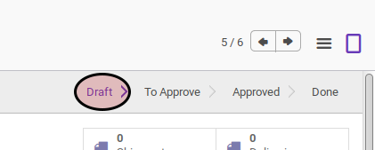

# Membuat RMA Customer

## A. INPUT

*(Tidak ada instruksi khusus)*

## B. LANGKAH KERJA

1. Buka menu **Warehouse -> Customer RMA -> Customer RMA**. Abaikan apabila sudah berada pada menu yang dimaksud.
2. Klik tombol **Create** pada bagian atas-kiri form.

3. Pilih **Customer**. Harus diisi.
4. Pilih **Assigned To**. Harus diisi.
5. Pilih **Requested By**. Harus diisi.
6. Isi **Partner Reference**. Tidak harus diisi.
7. Isi **Order Date**. Harus diisi.
8. Tambahkan/Modifikasi/Hapus Customer RMA Lines
9. Klik tombol **Save** pada bagian atas-kiri form.

## C. OUTPUT

* Data Customer RMA akan terbuat dengan status **Draft**

