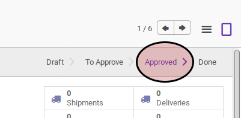

# Menyetujui RMA Customer

## A. INPUT

## B. LANGKAH KERJA

1. Buka menu **Warehouse -> Customer RMA -> Customer RMA**. Abaikan apabila sudah berada pada menu yang dimaksud.
2. Buka data Customer RMA yang akan disetujui. Abaikan jika data sudah dibuka
3. Klik tombol **Approve** pada bagian atas-kiri form.

## C. OUTPUT

* Data Customer RMA akan berubah menjadi **Approved**.

