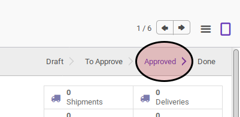
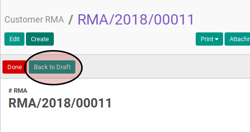
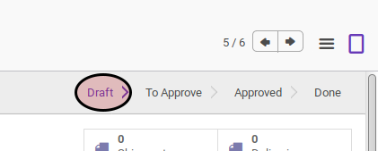

# Merestart RMA Customer

## A. INPUT

* Data customer RMA yang akan direstart harus memiliki status **Approve**.

* User yang akan merestart harus memiliki akses untuk merestart customer RMA.

## B. LANGKAH KERJA

1. Buka menu **Warehouse -> Customer RMA -> Customer RMA**. Abaikan apabila sudah berada pada menu yang dimaksud.
2. Buka data Customer RMA yang akan diselesaikan. Abaikan jika data sudah dibuka
3. Klik tombol **Back To Draft** pada bagian atas-kiri form.

## C. OUTPUT

* Data Customer RMA akan berubah menjadi **Draft**.

