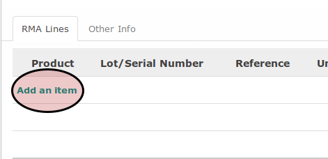
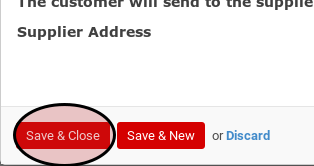
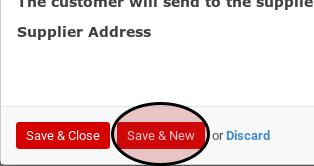

# Penambahan Customer RMA Lines Secara Manual

*(Prosedur ini tidak berdiri sendiri. Prosedur ini merupakan sub-prosedur dari [Prosedur Membuat Customer RMA](./membuat.md) atau Menyunting Customer RMA)*

## A. INPUT

*(Tidak ada instruksi khusus)*

## B. LANGKAH KERJA

1. <a name="l1">Klik</a> label **Add an Item** pada bagian bawah tabel **RMA Lines**.

2. Pilih **Product**. Harus diisi.
3. Isi **Ordered Qty**. Harus diisi.
4. Pilih dan sesuaikan **Unit of Measure** jika dibutuhkan. Harus diisi.
5. Isi **Price Unit**. Harus diisi.
6. Pilih **Operation**.
7. Pilih dan sesuaikan **Refund Policy** jika dibutuhkan. Harus diisi.
8. Pilih dan sesuaikan **Receipt Policy** jika dibutuhkan. Harus diisi.
9. Pilih dan sesuaikan **Delivery Policy** jika dibutuhkan. Harus diisi.
10. Pilih dan sesuaikan **Sale Policy** jika dibutuhkan. Harus diisi.
11. Pilih dan sesuaikan **RMA Supplier Policy** jika dibutuhkan. Harus diisi.
12. Isi **Deadline**. Harus diisi.
13. Pilih dan sesuaikan **Inbound Warehouse** jika dibutuhkan. Harus diisi.
14. Pilih dan sesuaikan **Send To This Company Location** jika dibutuhkan. Harus diisi.
15. Pilih dan sesuaikan **Inbound Route** jika dibutuhkan. Harus diisi.
16. Aktifkan atau matikan **The customer will send to the supplier** sesuai kebutuhan.
17. Pilih **Supplier Address**.
18. Pilih dan sesuaikan **Outbound Warehouse** jika dibutuhkan. Harus diisi.
19. Pilih dan sesuaikan **Partner delivery address** jika dibutuhkan. Harus diisi.
20. Pilih dan sesuaikan **Partner invoice address** jika dibutuhkan. Harus diisi.
21. Pilih dan sesuaikan **Outbound Route** jika dibutuhkan. Harus diisi.
22. <a name="l22">Klik</a> tombol **Save & Close** untuk menyimpan Customer RMA Line. Klik tombol **Save & New** untuk menyimpan Customer RMA Line dan menambahkan Customer RMA Line baru.

Tombol **Save & Close**

Tombol **Save & New**

23. Ulangi [langkah ke-1](#l1) apabila pada [langkah ke-22](#l22) tombol yang diklik adalah **Save & New**. Lanjutkan ke [langkah ke-8 Prosedur Penambahan Customer RMA](./membuat.md) atau [langkah ke-8 Prosedur Menyunting Customer RMA](./menyunting.md).

## C. OUTPUT

*(Tidak ada instruksi khusus)*
