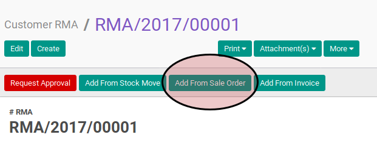
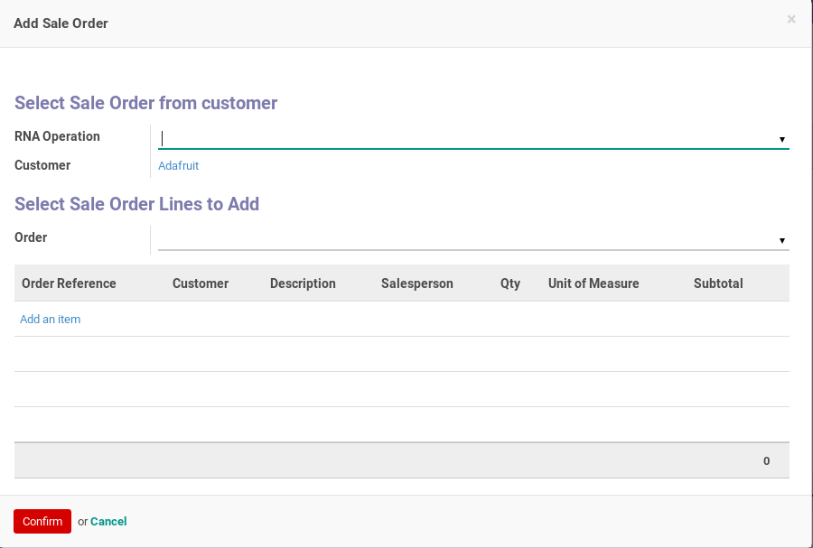
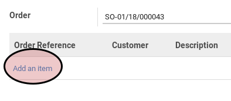
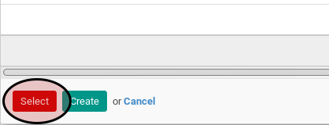

# Penambahan Customer RMA Lines Dengan Add From Sales Order

*(Prosedur ini tidak berdiri sendiri. Prosedur ini merupakan sub-prosedur dari [Prosedur Membuat Customer RMA](./membuat.md) atau Menyunting Customer RMA)*

## A. INPUT

## B. LANGKAH KERJA

1. klik tombol **Add From Sales Order** pada bagian atas-kiri form.

Pop-up **Add Sale Order** akan muncul

2. Pilih **RMA Operation**. Tidak harus diisi.
3. Pilih **Order**. Harus diisi.
4. Klik label **Add an Item** untuk memilih produk yang akan diretur/refund.

5. Pilihlah item penjualan yang akan diretur/refund.
6. Klik tombol **Select** pada bagian bawah-kiri pop-up **Add Sales Order Line**

7. Lanjutkan [langkah ke-8 Prosedur Membuat Customer RMA](./membuat.md#l8) atau langkah ke-8 Prosedur Menyunting Customer RMA
