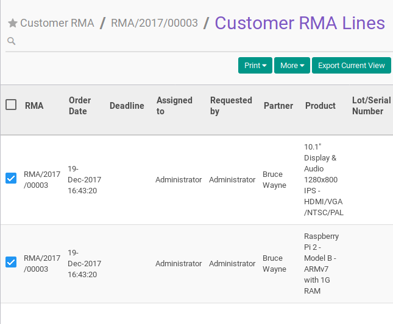
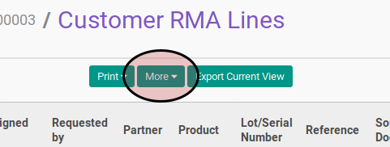
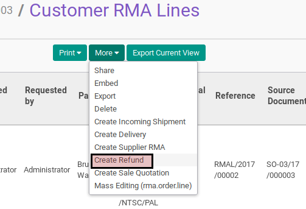

# Membuat Credit Note Dari RMA Customer Line

## A. INPUT

## B. LANGKAH KERJA

1. Buka menu **Warehouse -> Customer RMA -> Customer RMA**. Abaikan apabila sudah berada pada menu yang dimaksud.
2. Buka data Customer RMA yang akan dikonfirmasi. Abaikan jika data sudah dibuka
3. Klik tombol **RMA Lines** pada bagian atas-kanan form

4. Pilih RMA Lines yang akan dibuatkan credit notenya.

5. Klik tombol **More** pada bagian atas-tengah form

6. Klik tombol **Create Refund** pada drop-down yang muncul

Pop-up **Create Refund** akan muncul

7. Isi **Refund Date**. Harus diisi.
8. Untuk setiap produk yang akan dibuatkan credit notenya ubah **Qty To Refund**.
9. Klik tombol **Create Refund**
