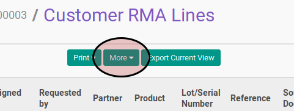

# Membuat RMA Customer In Dari RMA Customer Line

## A. INPUT

* Data customer RMA yang akan dibuatkan [RMA Customer In](../rma-customer-in.md) harus memiliki status **Approve**.

* User yang akan membuat [RMA Customer In](../rma-customer-in.md) dari customer RMA harus memiliki akses untuk membuat credit note dari customer RMA.

## B. LANGKAH KERJA

1. Buka menu **Warehouse -> Customer RMA -> Customer RMA**. Abaikan apabila sudah berada pada menu yang dimaksud.
2. Buka data Customer RMA yang akan dikonfirmasi. Abaikan jika data sudah dibuka
3. Klik tombol **RMA Lines** pada bagian atas-kanan form

4. Pilih RMA Lines yang akan dibuatkan [RMA Customer In](../rma-customer-in.md).

5. Klik tombol **More** pada bagian atas-tengah form

6. Klik tombol **Create Incoming Shipment** pada drop-down yang muncul

Pop-up **Create Incoming Shipment** akan muncul

7. Untuk setiap produk yang akan dibuatkan RMA Customer In-nya ubah **Qty To Receive**.
8. Klik tombol **Confirm** pada bagian bawah-kiri pop-up **Create Incoming Shipment**.

## C. OUTPUT

* [RMA Customer In](../rma-customer-in.md) akan terbuat dengan status **Waiting for Availability**.
