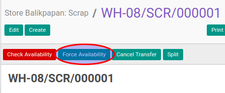

# Memaksa Ketersediaan Scrap

## A. INPUT

* Data scrap yang akan dipaksa ketersediannya harus memiliki status **Waiting Availability** atau **Partially Available**

* User yang akan memaksa ketersediaan harus memiliki akses untuk mengecek scrap.

## B. LANGKAH KERJA

1. Buka menu **Warehouse -> Operation -> (Nama Gudang) -> Scrap**. Abaikan jika sudah berada pada menu yang dimaksud.
2. Buka data scrap yang akan dipaksa ketersediaanya. Abaikan jika data sudah dibuka.
3. Klik tombol **Force Availability** pada bagian atas-kiri form.

## C. OUTPUT

* Status dari Scrap akan berubah menjadi **Ready To Transfer**.

