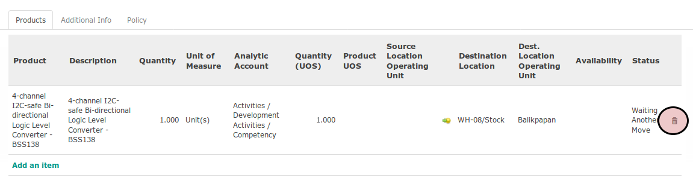

# Menghapus Produk Pada Supplier Promotion

*(Instruksi kerja ini merupakan sub instruksi dari (1) [Membuat Supplier Promotion](./membuat.md), atau (2) [Memodifikasi Supplier Promotion](./modifikasi.md). Instruksi kerja ini tidak bisa berdiri sendiri)*

## A. INPUT

*(Tidak ada prasyarat khusus)*

## B. INSTRUKSI KERJA

1. Buka tab **Products**.
2. Klik icon keranjang sampah pada bagian kanan data produk yang akan dihapus

3. Lanjutkan [langkah ke-12 Instruksi Membuat Supplier Promotion](./membuat.md#l12) atau [langkah ke-13 Instruksi Memodifikasi Supplier Promotion](./modifikasi.md#l13).

## C. OUTPUT

*(Tidak ada instruksi khusus)*
