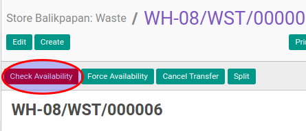

# Mengecek Ketersediaan Waste

## A. INPUT

* Data waste yang akan dicek harus memiliki status **Waiting Availability**.

* User yang akan mengecek harus memiliki akses untuk mengecek waste.

## B. LANGKAH KERJA

1. Buka menu **Warehouse -> Operation -> (Nama Gudang) -> Waste**. Abaikan jika sudah berada
pada menu yang dimaksud.
2. Buka data waste yang akan dicek. Abaikan jika data sudah dibuka.
3. Klik tombol **Check Availability** pada bagian atas-kiri form apabila user ingin melakukan pengecekan.

## C. OUTPUT

* Status dari Waste akan berubah menjadi **Ready To Transfer** apabila semua produk tersedia.

* Status dari Waste akan berubah menjadi **Partially Available** apabila hanya sebagian produk yang tersedia.

* Status dari Waste tetap **Waiting Availability** apabila produk tidak tersedia.

